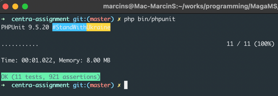
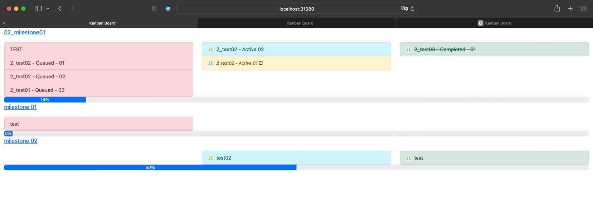
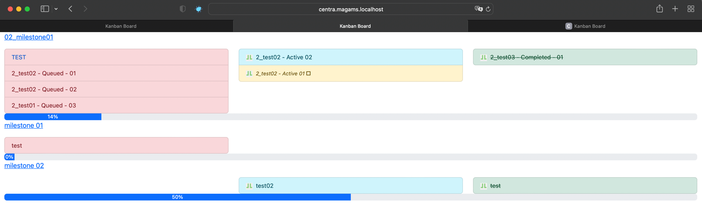
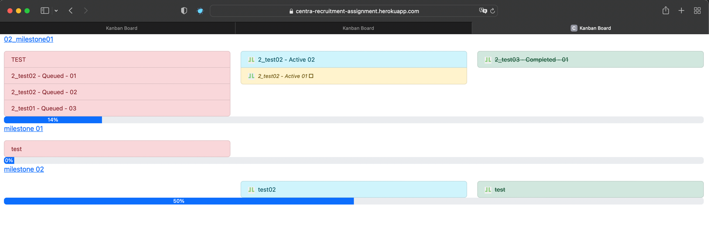

# Centra - recruitment assignment

**Author:** marcin.stanik@gmail.com

**Doc since:** 06.2022

**Used technologies:**
- PHP 8.1
- Git
- Composer
- Docker
- PHPUnit
- Heroku

## INSTALLATION

### ZIP
- unzip archive file

OR

### GIT

```shell
git clone git@github.com:staniol007/centra.git centra-assignment
```

```shell
cd centra-assignment
```

## RUNNING

### Two approaches:

### 1. Docker - recommended

#### Docker
```shell
docker-compose up -d --build
```

#### Docker URL - complete the configuration process before using the URL :) 

[localhost:31080](http://localhost:31080)

### 2. local web server

Requirements:
- php8.1
- Nginx or Apache
  
Example Nginx configuration: [assets/nginx.config](assets/nginx.config)

#### Composer
```shell
composer install
```

## CONFIGURATION
> IMPORTANT! \
> `GH_CLIENT_ID` and `GH_CLIENT_SECRET` environment variables are deprecated \
> Getting token by credential data is not available any more - please go to GitHub: \
> Settings / Developer settings / Personal access tokens and generate new token

### new .env.local
```shell
touch .env.local
```

### add DEV configuration (environment variables)
```shell
echo 'APP_ENV=dev' >> .env.local
echo 'GH_TOKEN=YourSecretGithubToken' >> .env.local
echo 'GH_ACCOUNT=YourGithubAccount' >> .env.local
echo 'GH_REPOSITORIES=YourRepositoriesSeparatedBy|' >> .env.local
```

## PHPUnit

### executing ALL PHPUnit 

```shell
php bin/phpunit
```

### executing single PHPUnit
```shell
php bin/phpunit tests/Library/UtilitiesTest.php
```

### example result:


## HEROKU URL

[centra-recruitment-assignment.herokuapp.com](https://centra-recruitment-assignment.herokuapp.com)

## WEB APPLICATION SCREENS

### Docker


### Local web server


### Heroku



